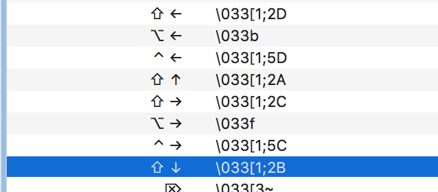

# Jack's Dotfiles

My dotfiles for Vim and ZSH. Shamelessly stolen from tonnes of dotfile repositories I found online.

Files are symlinked into the proper location, and have the `.` added. For example:

```
~/dotfiles/vim/vim => ~/.vim
~/dotfiles/vim/vimrc => ~/.vimrc
~/dotfiles/zsh/zshrc => ~/.zshrc
~/dotfiles/git/gitignore_global => ~/.gitignore_global
...and so on
```
# Installing

- Swap your shell to ZSH (System Prefs -> Users -> Right Click on 'Advanced Settings' -> select ZSH from dropdown).
- Clone repository into `~/dotfiles`
- `cd ~/dotfiles`
- Go through the `Makefile` and run the commands to get the things up that you'd like.

# Vim Plugins

Are all handled with Vim Plug.

# Setting up Terminal.app

- Install the `Chalk.terminal` theme.
- Install [Input Mono](http://input.fontbureau.com/preview/)
- Configure Shift+UP and Shift+DOWN to send the right sequence (such that you can use shift + arrow keys to resize Tmux splits.



# Other apps to install that are not in the `Brewfile`

- Mac App Store
    - Divvy
- 1Password
- Mega Sync
- [Karabiner Elements](https://github.com/tekezo/Karabiner-Elements/)
